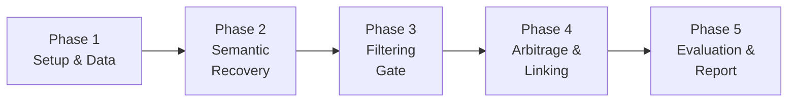

# POMABuster — Phased Implementation Plan

## How to Recreate the Research in Manageable Phases

---

> [!IMPORTANT]
> This plan breaks down the POMABuster research reproduction into **5 phases**, each building on the previous one. Each phase has clear objectives, deliverables, estimated time, prerequisites, and verification steps.

---

## Phase Overview

```
Phase 1: Environment Setup & Data Acquisition ........ [Week 1-2]
Phase 2: Semantic Recovery Engine ..................... [Week 3-4]
Phase 3: SEC-Inspired Filtering Gate .................. [Week 5-6]
Phase 4: Arbitrage Detection & Linking Engine ......... [Week 7-8]
Phase 5: Evaluation, Comparison & Reporting ........... [Week 9-10]
```



---

## Phase 1: Environment Setup & Data Acquisition

### 🎯 Objective
Set up the complete development environment and acquire all necessary datasets so you can hit the ground running in Phase 2.

### 📋 Tasks

#### 1.1 — Clone the Repository
```bash
git clone https://github.com/DependableSystemsLab/POMABuster.git
cd POMABuster
```

#### 1.2 — Set Up Python Environment
```bash
# Create a virtual environment
python -m venv pomabuster_env
# Activate it
# Windows:
pomabuster_env\Scripts\activate
# Linux/Mac:
source pomabuster_env/bin/activate

# Install core dependencies
pip install jupyter pandas numpy matplotlib scrapy
pip install google-cloud-bigquery  # For BigQuery access
pip install ethereum-etl           # For blockchain data extraction
```

#### 1.3 — Download Transaction Dataset from Zenodo
- Go to: https://zenodo.org/records/10359283
- Download the complete transaction dataset
- Place it in the `dataset/` directory
- Understand the data format:
  ```
  block_hash, transaction_hash, log_index, token_address, from_address, to_address, value
  ```

#### 1.4 — Set Up Google BigQuery Access (Alternative Data Source)
- Create a Google Cloud Platform account (free tier available)
- Enable the BigQuery API
- Access the public Ethereum dataset: `bigquery-public-data.crypto_ethereum`
- Practice running basic queries:
  ```sql
  SELECT * FROM `bigquery-public-data.crypto_ethereum.token_transfers`
  WHERE block_timestamp >= '2021-01-01'
  LIMIT 100
  ```

#### 1.5 — Set Up Etherscan API Access
- Register at https://etherscan.io/register
- Get a free API key (needed for scraping token data)
- Store it securely (environment variable or config file)

#### 1.6 — Run the Token Scrapers
```bash
# Navigate to the scraper directory
cd src/tokens/scrape_erc20

# Run the ERC-20 token metadata scraper
scrapy crawl erc20 -o erc20.jsonlines

# Run the token holder distribution scraper
scrapy crawl holder -o holders.jsonlines
```

#### 1.7 — Study the External Dataset
- Read through ALL files in `dataset/external_dataset/`
- Understand each Code4rena audit report:
  - What vulnerability was found?
  - How could it be exploited?
  - What tokens and contracts were involved?
- Note the corrections in `83.md` and `193.md` (not POMAs)

### ✅ Deliverables
- [ ] Python environment fully configured with all dependencies
- [ ] Transaction dataset downloaded and accessible
- [ ] BigQuery access configured (optional but recommended)
- [ ] Token metadata scraped from Etherscan (`erc20.jsonlines`)
- [ ] Token holder data scraped (`holders.jsonlines`)
- [ ] External audit dataset reviewed and understood
- [ ] Familiarity with data formats and column meanings

### 🧪 Verification
- Load the Zenodo dataset into a Pandas DataFrame and print the first 10 rows
- Load `erc20.jsonlines` and verify token metadata looks correct
- Run a basic BigQuery query and verify results match Zenodo data

### ⏱️ Estimated Time: 1-2 weeks

---

## Phase 2: Semantic Recovery Engine

### 🎯 Objective
Build the engine that converts raw transfer logs into high-level DeFi actions (trades, liquidity operations, mints/burns).

### 📋 Tasks

#### 2.1 — Define Core Data Structures
```python
from dataclasses import dataclass

@dataclass
class Log:
    sender: str       # Source address
    receiver: str     # Destination address
    amount: int       # Token amount (raw, with decimals)
    asset: str        # Token contract address
    idx: int          # Log index within transaction

@dataclass
class Trade:
    operator: str     # Who initiated the action
    recipient: str    # Who benefited
    pool: str         # DEX pool address
    asset_in: str     # Token sent to pool
    asset_out: str    # Token received from pool
    amount_in: int    # Amount sent
    amount_out: int   # Amount received
    log_idx: int      # For ordering
```

#### 2.2 — Implement Transfer Classification Functions
```python
ZERO_ADDRESS = "0x0000000000000000000000000000000000000000"

def is_transfer_normal(log: Log) -> bool:
    """Standard transfer between two real addresses"""
    return (log.sender != ZERO_ADDRESS and 
            log.receiver != ZERO_ADDRESS and 
            log.amount > 0)

def is_transfer_minting(log: Log) -> bool:
    """Token creation (from zero address)"""
    return log.sender == ZERO_ADDRESS and log.amount > 0

def is_transfer_burning(log: Log) -> bool:
    """Token destruction (to zero address)"""
    return log.receiver == ZERO_ADDRESS and log.amount > 0
```

#### 2.3 — Implement DeFi Action Detection
```python
from itertools import pairwise

def has_liquidity_mining(logs: list[Log]) -> list[Trade]:
    """Detect liquidity providing: user sends tokens, receives LP tokens"""
    trades = []
    normal_logs = [l for l in logs if is_transfer_normal(l)]
    mint_logs = [l for l in logs if is_transfer_minting(l)]
    
    for normal, mint in pairwise(normal_logs + mint_logs):
        if is_transfer_normal(normal) and is_transfer_minting(mint):
            # User sent tokens to pool, received LP tokens
            trades.append(Trade(
                operator=normal.sender,
                recipient=mint.receiver,
                pool=normal.receiver,
                asset_in=normal.asset,
                asset_out=mint.asset,
                amount_in=normal.amount,
                amount_out=mint.amount,
                log_idx=normal.idx
            ))
    return trades

def has_liquidity_cancel(logs: list[Log]) -> list[Trade]:
    """Detect liquidity removal: user burns LP tokens, receives assets"""
    trades = []
    normal_logs = [l for l in logs if is_transfer_normal(l)]
    burn_logs = [l for l in logs if is_transfer_burning(l)]
    
    for burn, normal in pairwise(burn_logs + normal_logs):
        if is_transfer_burning(burn) and is_transfer_normal(normal):
            trades.append(Trade(
                operator=burn.sender,
                recipient=normal.receiver,
                pool=normal.sender,
                asset_in=burn.asset,
                asset_out=normal.asset,
                amount_in=burn.amount,
                amount_out=normal.amount,
                log_idx=burn.idx
            ))
    return trades
```

#### 2.4 — Build Transaction Parser
```python
import json

def parse_record(record: dict) -> list[Log]:
    """Parse a BigQuery/Ethereum-ETL record into Log objects"""
    logs = []
    for transfer in record.get('token_transfers', []):
        logs.append(Log(
            sender=transfer['from_address'],
            receiver=transfer['to_address'],
            amount=int(transfer['value']),
            asset=transfer['token_address'],
            idx=transfer['log_index']
        ))
    return sorted(logs, key=lambda l: l.idx)
```

#### 2.5 — Test Against Known Transactions
- Take 5-10 known POMA transactions from the external dataset
- Run them through your semantic recovery engine
- Verify the output correctly identifies the DeFi actions

### ✅ Deliverables
- [ ] `Log` and `Trade` data classes implemented
- [ ] Transfer classification functions working (normal, mint, burn)
- [ ] Liquidity mining detection working
- [ ] Liquidity cancellation detection working
- [ ] Normal swap/trade detection working
- [ ] Transaction parser for BigQuery/Zenodo data working
- [ ] Tested against at least 5 known transactions

### 🧪 Verification
- Parse a known POMA transaction and verify all logs are correctly classified
- Check that liquidity mining events produce the expected `Trade` objects
- Verify no logs are being dropped or miscategorized

### ⏱️ Estimated Time: 2 weeks

---

## Phase 3: SEC-Inspired Filtering Gate

### 🎯 Objective
Implement the rule-based filtering system that separates normal trading from potentially manipulative behavior, inspired by SEC market manipulation definitions.

### 📋 Tasks

#### 3.1 — Analyze Token Holder Concentration
```python
import pandas as pd
import matplotlib.pyplot as plt

def analyze_holder_concentration(holders_data: str):
    """
    Load token holder data and compute concentration metrics.
    Tokens where top holders own >30% are high-risk for manipulation.
    """
    holders_df = pd.read_json(holders_data, lines=True)
    
    # Pivot: tokens × holder percentage
    pivot = holders_df.pivot_table(
        index='token_address',
        values='percentage',
        aggfunc='sum'
    )
    
    # Flag high-concentration tokens
    high_risk = pivot[pivot['percentage'] > 30]
    
    # Visualize top 100 holder percentages
    pivot.sort_values('percentage', ascending=False).head(100).plot(
        kind='bar', figsize=(20, 6),
        title='Top 100 Token Holder Concentration'
    )
    plt.ylabel('Top Holder %')
    plt.tight_layout()
    plt.savefig('holder_concentration.png')
    
    return high_risk
```

#### 3.2 — Implement Trade Size Anomaly Detection
```python
def is_trade_abnormally_large(trade: Trade, pool_liquidity: float, 
                               threshold: float = 0.05) -> bool:
    """
    Flag if trade moves more than threshold% of pool liquidity.
    Normal trades rarely exceed 1-2% of pool size.
    Default threshold: 5%
    """
    trade_size = trade.amount_in
    return (trade_size / pool_liquidity) > threshold
```

#### 3.3 — Implement Round-Trip Detection
```python
def detect_round_trip(trades: list[Trade], block_window: int = 2) -> list:
    """
    Detect buy-then-sell (or sell-then-buy) patterns by the same operator
    within a short block window. This is a classic manipulation signature.
    """
    round_trips = []
    for i, t1 in enumerate(trades):
        for t2 in trades[i+1:]:
            if (t1.operator == t2.operator and 
                t1.asset_in == t2.asset_out and
                t1.asset_out == t2.asset_in and
                abs(t1.log_idx - t2.log_idx) <= block_window):
                round_trips.append((t1, t2))
    return round_trips
```

#### 3.4 — Implement Block Proximity Filter
```python
def filter_suspicious_by_proximity(transactions_df: pd.DataFrame,
                                    block_window: int = 2) -> pd.DataFrame:
    """
    Flag transactions that cluster within a tight block window.
    Manipulators need precise timing; legitimate traders don't.
    """
    transactions_df = transactions_df.sort_values('block_number')
    transactions_df['block_diff'] = transactions_df['block_number'].diff()
    suspicious = transactions_df[transactions_df['block_diff'] <= block_window]
    return suspicious
```

#### 3.5 — Combine All Filters into the Filtering Gate
```python
def filtering_gate(trades: list[Trade], 
                   pool_data: dict,
                   holder_data: pd.DataFrame) -> list[Trade]:
    """
    Master filtering function. A trade passes the gate if it meets
    ANY of the SEC-inspired criteria:
    1. Abnormally large trade size
    2. Part of a round-trip pattern
    3. Involves a high-concentration token
    4. Occurs in tight block proximity with other suspicious trades
    """
    suspicious = []
    
    for trade in trades:
        flags = []
        
        # Check 1: Trade size
        pool_liq = pool_data.get(trade.pool, float('inf'))
        if is_trade_abnormally_large(trade, pool_liq):
            flags.append("LARGE_TRADE")
        
        # Check 2: Token concentration
        if trade.asset_in in holder_data.index:
            flags.append("HIGH_CONCENTRATION")
        
        if flags:
            trade.flags = flags
            suspicious.append(trade)
    
    # Check 3: Round-trip patterns
    round_trips = detect_round_trip(suspicious)
    for t1, t2 in round_trips:
        t1.flags.append("ROUND_TRIP")
        t2.flags.append("ROUND_TRIP")
    
    return suspicious
```

#### 3.6 — Validate Against Known POMAs
- Run the filtering gate against the Code4rena audit dataset
- Verify known POMAs are correctly flagged
- Check that benign transactions (83.md, 193.md) are NOT flagged

### ✅ Deliverables
- [ ] Token holder concentration analysis working
- [ ] Trade size anomaly detector working
- [ ] Round-trip pattern detector working
- [ ] Block proximity filter working
- [ ] Combined filtering gate function working
- [ ] Visualization of token holder distribution
- [ ] Validated against known POMA and non-POMA cases

### 🧪 Verification
- Run against the full Zenodo dataset and measure how many transactions pass through
- Expected: vast majority of transactions should be filtered OUT (only suspicious ones pass)
- Compare flagged transactions against the Code4rena ground truth

### ⏱️ Estimated Time: 2 weeks

---

## Phase 4: Arbitrage Detection & Linking Engine

### 🎯 Objective
Build the engine that identifies arbitrage transactions and links them to price manipulation transactions, completing the POMA detection pipeline.

### 📋 Tasks

#### 4.1 — Implement Arbitrage Detection
```python
def detect_arbitrage(trades: list[Trade]) -> list[dict]:
    """
    Detect arbitrage: someone buys Token A cheap on Exchange X,
    sells Token A expensive on Exchange Y, pockets the difference.
    
    Key signal: Same operator, same token, different pools, net profit.
    """
    arb_events = []
    
    # Group trades by operator
    by_operator = {}
    for trade in trades:
        by_operator.setdefault(trade.operator, []).append(trade)
    
    for operator, op_trades in by_operator.items():
        # Look for buy-sell pairs of the same token on different pools
        for i, t1 in enumerate(op_trades):
            for t2 in op_trades[i+1:]:
                if (t1.asset_out == t2.asset_in and  # Token bought = Token sold
                    t1.pool != t2.pool and             # Different pools
                    t2.amount_out > t1.amount_in):     # Net profit
                    arb_events.append({
                        'operator': operator,
                        'buy_trade': t1,
                        'sell_trade': t2,
                        'profit': t2.amount_out - t1.amount_in,
                        'token': t1.asset_out,
                        'block_number': t1.log_idx
                    })
    return arb_events
```

#### 4.2 — Implement the POM↔ARB Linking Engine
```python
def link_pom_to_arb(pom_transactions: pd.DataFrame,
                    arb_transactions: pd.DataFrame,
                    block_window: int = 2) -> list[dict]:
    """
    THE CORE LINKING ALGORITHM
    
    For each suspected Price Oracle Manipulation (POM) transaction:
    1. Find ARB transactions within 0-2 blocks
    2. Check if they share tokens
    3. If both conditions met → POMA DETECTED
    """
    linked_attacks = []
    
    for _, pom in pom_transactions.iterrows():
        pom_block = pom['block_number']
        pom_assets = set(pom['tokens_involved'])
        pom_hash = pom['transaction_hash']
        
        # Find arbitrage within the block window
        nearby_arbs = arb_transactions[
            (arb_transactions['block_number'] >= pom_block) &
            (arb_transactions['block_number'] <= pom_block + block_window)
        ]
        
        for _, arb in nearby_arbs.iterrows():
            arb_assets = set(arb['tokens_involved'])
            arb_hash = arb['transaction_hash']
            
            # Check for shared tokens
            shared = arb_assets.intersection(pom_assets)
            
            if shared:
                linked_attacks.append({
                    'pom_tx': pom_hash,
                    'arb_tx': arb_hash,
                    'shared_tokens': list(shared),
                    'pom_block': pom_block,
                    'arb_block': arb['block_number'],
                    'block_distance': arb['block_number'] - pom_block
                })
    
    return linked_attacks
```

#### 4.3 — Build the Complete Pipeline
```python
def run_pomabuster(transaction_data: pd.DataFrame,
                   pool_data: dict,
                   holder_data: pd.DataFrame) -> list[dict]:
    """
    Complete POMABuster pipeline: Semantic Recovery → Filtering → Linking
    """
    # Stage 1: Semantic Recovery
    all_trades = []
    for _, record in transaction_data.iterrows():
        logs = parse_record(record)
        trades = detect_all_defi_actions(logs)  # combines all detectors
        all_trades.extend(trades)
    
    # Stage 2: Filtering Gate
    suspicious_trades = filtering_gate(all_trades, pool_data, holder_data)
    
    # Stage 3: Arbitrage Detection
    arb_events = detect_arbitrage(all_trades)
    
    # Stage 4: Linking
    pom_df = pd.DataFrame([t.__dict__ for t in suspicious_trades])
    arb_df = pd.DataFrame(arb_events)
    
    attacks = link_pom_to_arb(pom_df, arb_df)
    
    return attacks
```

#### 4.4 — Run on the Full Dataset
- Execute the complete pipeline on the Zenodo transaction dataset
- Record all detected POMAs
- Save results in a structured format (CSV/JSON)

### ✅ Deliverables
- [ ] Arbitrage detection algorithm working
- [ ] POM↔ARB linking engine working  
- [ ] Complete pipeline function integrating all 3 stages
- [ ] Full dataset analysis completed
- [ ] Results saved in structured format
- [ ] List of all detected POMA transaction pairs

### 🧪 Verification
- Cross-reference detected POMAs against known attacks in the Code4rena dataset
- Verify the linking correctly identifies known attack-arbitrage pairs
- Check that the block window constraint works correctly

### ⏱️ Estimated Time: 2 weeks

---

## Phase 5: Evaluation, Comparison & Reporting

### 🎯 Objective
Evaluate POMABuster's performance, compare against DeFiRanger, run the ablation study, and produce a comprehensive report with visualizations.

### 📋 Tasks

#### 5.1 — Implement DeFiRanger Baseline
```python
# Implement a simplified version of DeFiRanger for comparison
# Key limitation: single-transaction detection only
def defiranger_detect(transaction_data: pd.DataFrame) -> list:
    """
    Simplified DeFiRanger: only detects POMAs within a single transaction.
    This serves as the baseline comparison.
    """
    detected = []
    for _, record in transaction_data.iterrows():
        logs = parse_record(record)
        # DeFiRanger only looks within a single transaction
        if has_manipulation_and_arbitrage_in_same_tx(logs):
            detected.append(record['transaction_hash'])
    return detected
```

#### 5.2 — Calculate Performance Metrics
```python
def evaluate_performance(detected: list, ground_truth: list) -> dict:
    """
    Calculate standard evaluation metrics.
    """
    detected_set = set(detected)
    truth_set = set(ground_truth)
    
    true_positives = detected_set.intersection(truth_set)
    false_positives = detected_set - truth_set
    false_negatives = truth_set - detected_set
    
    precision = len(true_positives) / (len(true_positives) + len(false_positives))
    recall = len(true_positives) / (len(true_positives) + len(false_negatives))
    f1 = 2 * precision * recall / (precision + recall)
    
    return {
        'true_positives': len(true_positives),
        'false_positives': len(false_positives),
        'false_negatives': len(false_negatives),
        'precision': precision,
        'recall': recall,
        'f1_score': f1,
        'detection_rate': recall  # Same as recall
    }
```

#### 5.3 — Run Ablation Study
```python
def ablation_study(transaction_data, pool_data, holder_data, ground_truth):
    """
    Test each component's contribution by removing one at a time.
    """
    results = {}
    
    # Full system
    full = run_pomabuster(transaction_data, pool_data, holder_data)
    results['full_system'] = evaluate_performance(full, ground_truth)
    
    # Without semantic recovery (use raw logs only)
    no_semantic = run_pomabuster_no_semantic(transaction_data, pool_data, holder_data)
    results['no_semantic_recovery'] = evaluate_performance(no_semantic, ground_truth)
    
    # Without filtering gate (pass all trades)
    no_filter = run_pomabuster_no_filter(transaction_data, pool_data, holder_data)
    results['no_filtering_gate'] = evaluate_performance(no_filter, ground_truth)
    
    # Without linking (detect POM only, no ARB correlation)
    no_linking = run_pomabuster_no_linking(transaction_data, pool_data, holder_data)
    results['no_linking'] = evaluate_performance(no_linking, ground_truth)
    
    # Without holder analysis
    no_holders = run_pomabuster_no_holders(transaction_data, pool_data)
    results['no_holder_analysis'] = evaluate_performance(no_holders, ground_truth)
    
    return results
```

#### 5.4 — Generate Visualizations
```python
# Comparison chart: POMABuster vs DeFiRanger
def plot_comparison(pomabuster_results, defiranger_results):
    metrics = ['Precision', 'Recall', 'F1 Score']
    pb_values = [pomabuster_results['precision'], 
                 pomabuster_results['recall'],
                 pomabuster_results['f1_score']]
    dr_values = [defiranger_results['precision'],
                 defiranger_results['recall'],
                 defiranger_results['f1_score']]
    
    x = range(len(metrics))
    plt.bar([i - 0.2 for i in x], pb_values, 0.4, label='POMABuster')
    plt.bar([i + 0.2 for i in x], dr_values, 0.4, label='DeFiRanger')
    plt.xticks(x, metrics)
    plt.ylabel('Score')
    plt.title('POMABuster vs DeFiRanger Performance')
    plt.legend()
    plt.savefig('comparison.png')
```

#### 5.5 — Write Final Report
Create a report covering:
1. **Reproduction methodology** — What you did and how
2. **Results** — Your detection results vs. the paper's claimed results
3. **Comparison** — POMABuster vs. DeFiRanger numbers
4. **Ablation** — Which components contribute most
5. **Observations** — Anything new you discovered
6. **Challenges** — What was hard and how you solved it

### ✅ Deliverables
- [ ] DeFiRanger baseline implementation
- [ ] Performance metrics calculated (precision, recall, F1)
- [ ] Comparison table: POMABuster vs DeFiRanger
- [ ] Ablation study results
- [ ] Visualization charts
- [ ] Comprehensive written report
- [ ] Reproducibility notes (for others to follow)

### 🧪 Verification
- Your detected POMA count should be approximately **6.5× DeFiRanger's count**
- False negative rate should be near **0%**
- False positive rate should be near **1%**
- Ablation should show each component contributes measurably

### ⏱️ Estimated Time: 2 weeks

---

## Summary Table

| Phase | Focus | Key Output | Time |
|---|---|---|---|
| **1** | Setup & Data | Working environment, all datasets ready | 1-2 weeks |
| **2** | Semantic Recovery | Engine that understands DeFi transactions | 2 weeks |
| **3** | Filtering Gate | SEC-inspired suspicious trade detector | 2 weeks |
| **4** | Arbitrage & Linking | Complete POMA detection pipeline | 2 weeks |
| **5** | Evaluation | Performance numbers, comparison, report | 2 weeks |

**Total estimated time: 9-10 weeks**

---

## Tools & Technologies Needed

| Tool | Purpose | Where to Get It |
|---|---|---|
| Python 3.10+ | Main programming language | python.org |
| Jupyter Notebook | Interactive analysis | `pip install jupyter` |
| Pandas | Data manipulation | `pip install pandas` |
| NumPy | Numerical operations | `pip install numpy` |
| Matplotlib | Visualizations | `pip install matplotlib` |
| Scrapy | Web scraping (Etherscan) | `pip install scrapy` |
| Google BigQuery | Ethereum data access | cloud.google.com |
| Ethereum-ETL | Blockchain data extraction | `pip install ethereum-etl` |
| Git | Version control | git-scm.com |

---

## Risk Factors & Mitigations

| Risk | Impact | Mitigation |
|---|---|---|
| BigQuery costs may exceed free tier | Can't access full dataset | Use the Zenodo pre-downloaded dataset instead |
| Etherscan rate limits | Scraping slows down | Use API key, add delays between requests |
| Large dataset processing time | Hours of computation | Use sampling for development, full dataset for final run |
| DeFiRanger paper not fully available | Can't implement accurate baseline | Use the `defiranger.ipynb` from the POMABuster repo |
| New Ethereum upgrades may change data format | Code breaks | Pin to the same time period as the original paper |

---

> [!TIP]
> **Pro tip:** Start each phase by thoroughly reading the corresponding notebook in the POMABuster repo. The notebooks contain actual working code that you can reference, adapt, and extend. Don't reinvent the wheel — build on what exists.

> [!NOTE]
> **Key reference notebooks for each phase:**
> - Phase 2: `src/sec/arbitrage_filter.ipynb` (data structures & semantic recovery)
> - Phase 3: `src/sec/analyze_token_holder.ipynb` (holder analysis) + `src/sec/pomabuster.ipynb` (filters)
> - Phase 4: `src/sec/linking.ipynb` (linking engine)
> - Phase 5: `src/sec/defiranger.ipynb` (baseline) + `src/sec/ablate.ipynb` (ablation)
