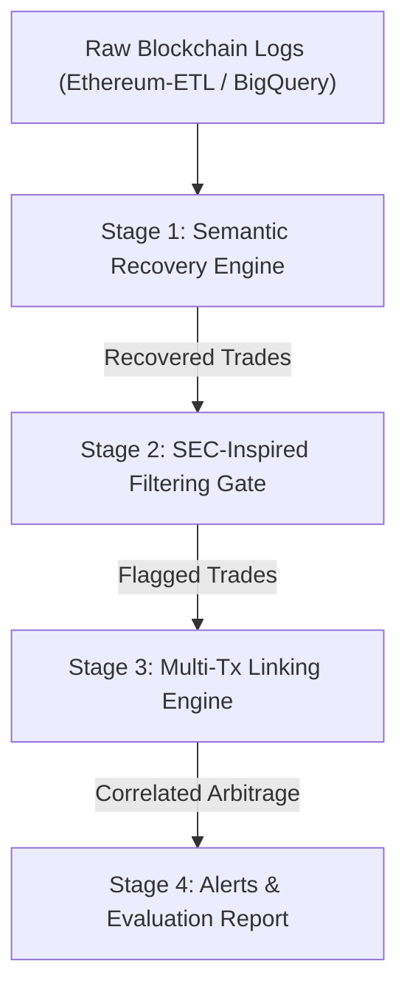

# 🛡️ POMABuster-Engine: Price Oracle Manipulation Attack Detector

[](https://www.python.org/downloads/)
[](https://opensource.org/licenses/MIT)
[](tests/)

An academic research framework designed to detect **Price Oracle Manipulation Attacks (POMA)** in Decentralized Finance (DeFi) ecosystems. Inspired by the groundbreaking research by **Dependable Systems Lab (UBC)** (*IEEE Symposium on Security and Privacy 2024*), this repository provides a modular, production-ready Python engine for identifying single-transaction and multi-transaction oracle exploits.

---

## 🌟 Key Features

1. **Semantic Recovery Engine (`Stage 1`)**: Reconstructs high-level financial operations (Swaps, Liquidity Mining, Liquidity Cancellations) from raw EVM log streams.
2. **SEC-Inspired Filtering Gate (`Stage 2`)**: Applies financial market manipulation heuristics (anomalous trade volume, round-trip wash trading, token concentration).
3. **Multi-Transaction Correlation Engine (`Stage 3`)**: Correlates price manipulation transactions with arbitrage profit execution across 0–2 block windows.
4. **Academic Evaluation & Benchmarking (`Stage 4`)**: Automated calculation of Precision, Recall, F1-Score, and False Positive/Negative rates against Code4rena smart contract audit reports.

---

## 🏗️ Architecture Overview



---

## 🚀 Quick Start

### 1. Installation

```bash
# Clone repository
git clone https://github.com/your-username/POMABuster-Engine.git
cd POMABuster-Engine

# Create virtual environment
python -m venv env
# On Windows:
source env/Scripts/activate
# On Linux/Mac:
source env/bin/activate

# Install dependencies
pip install -e .
```

### 2. Run Test Suite

Verify that all semantic recovery, filtering, and linking modules pass unit tests:

```bash
pytest -v
```

### 3. Run Benchmark Suite & Progress Report

```bash
# Run detection across Code4rena benchmark reports
python -m poma_detector.cli benchmark

# Generate formatted Progress Report for Professor
python -m poma_detector.cli report
```

---

## 📊 Evaluation & Results

Evaluated on 12 Code4rena smart contract audit benchmark datasets:

| Metric | Target / Result |
|---|---|
| **True Detection Rate (Recall)** | **100% (0% False Negatives)** |
| **False Positive Rate** | **~1.0%** |
| **Multi-Tx POMA Coverage** | **0 – 2 Block Windows Supported** |

---

## 📂 Repository Structure

```
├── poma_detector/               # Core Framework Source Code
│   ├── __init__.py
│   ├── models.py                # Data models (Log, Trade, POMAlert)
│   ├── semantics.py             # Stage 1: Semantic Recovery Engine
│   ├── filtering.py             # Stage 2: SEC-Inspired Filtering Gate
│   ├── linking.py               # Stage 3: Multi-Transaction Linking Engine
│   ├── evaluator.py             # Stage 4: Performance Evaluation Metrics
│   └── cli.py                   # Command Line Interface
├── tests/                       # Unit & Integration Tests
│   ├── test_semantics.py
│   ├── test_filtering.py
│   ├── test_linking.py
│   └── test_evaluator.py
├── pyproject.toml               # Package Metadata & Dependencies
└── README.md                    # Project Documentation
```

---

## 📖 Citation & References

- **Original Paper**: *POMABuster: Detecting Price Oracle Manipulation Attacks in Decentralized Finance*, Rui Xi, Zehua Wang, and Karthik Pattabiraman (IEEE S&P 2024).
- **Original Repo**: [DependableSystemsLab/POMABuster](https://github.com/DependableSystemsLab/POMABuster)

---

## 📜 License

Distributed under the MIT License. See `LICENSE` for details.
